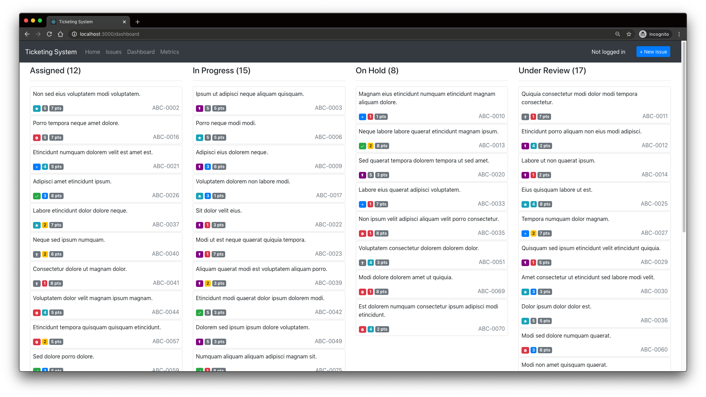
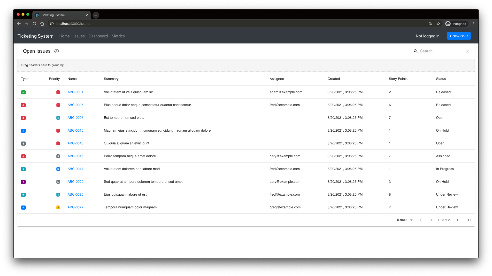
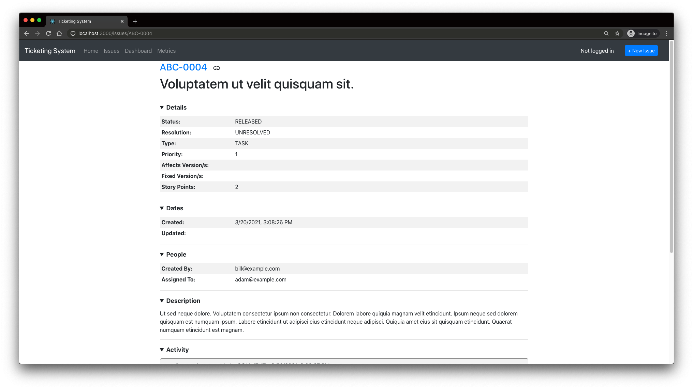

# Ticketing System

### Overview

Jira-inspired issue & ticket tracker. Current features include new issue creation/editing, issue commenting & automatic update tracking, backlog browsing with filter/group/sort functionality, user authentication & session persistence, and metric visualizations.

### Technology Stack

| Service | Framework | Module |
|:--------|:----------|:-------|
| Frontend | React | `ui` |
| Backend | Flask | `api` |
| Database | Postgres | `db` |
| Monitoring | Grafana | `grafana` |
| Proxy | Nginx | `proxy` |

---

### Screenshots







---

### Roadmap

- Differentiate between types of Activity updates, track `field`, `old_value`, `new_value` as columns
- Generate and view a detailed flow diagram for individual issues showing changes over time
- Back token authentication with Redis store using auto-expire keys
- Convert database Models to entirely integer-based Enums with auto de/serialization within Schemas, generate corresponding JS client Enums
- OpenAPI-compliant backend with Swagger documentation for routes and models

---

### Table Schemas

**`issues`**

| Column | Type | Possible Values |
|:---|:---|:---|
| id | `int` |  |
| created_on | `bigint` |  |
| updated_on | `bigint` |  |
| created_by | `string` |  |
| issue_name | `string` |  |
| issue_project | `string` |  |
| issue_type | `enum` | BUG, TASK, FEATURE, REQUIREMENT, SUPPORT, EPIC |
| issue_priority | `enum` | 1, 2, 3, 4, 5 |
| issue_story_points | `int` |  |
| issue_summary | `string` |  |
| issue_description | `string` |  |
| issue_status | `enum` | OPEN, ASSIGNED, IN_PROGRESS, ON_HOLD, UNDER_REVIEW, DONE, RELEASED |
| issue_resolution | `enum` | INVALID, WONT_FIX, OVERCOME_BY_EVENTS, UNABLE_TO_REPLICATE, DUPLICATE, COMPLETE |
| issue_affected_version | `string` |  |
| issue_fixed_version | `string` |  |
| issue_assigned_to | `string` |  |

---

**`activity`**
> Relationship: *many-to-one* with `issues`

| Column | Type | Possible Values |
|:---|:---|:---|
| id | `int` |  |
| created_on | `bigint` |  |
| updated_on | `bigint` |  |
| created_by | `string` |  |
| issue_id | `int` |  |
| issue_name | `string` |  |
| activity_type | `enum` | COMMENT, ASSIGNMENT, STATUS, RESOLUTION |
| activity_text | `string` |  |

---

**`users`**

| Column | Type | Possible Values |
|:---|:---|:---|
| id | `int` |  |
| created_on | `bigint` |  |
| updated_on | `bigint` |  |
| username | `string` |  |
| password | `hash[string]` |  |
| user_type | `string` | ADMIN, USER |
| user_email | `string` | ** TODO ** |

---

**`enums`**

| Table Name | Table Column | Name | Value |
|:---|:---|:---|:---|
| issues | issue_type | UNKNOWN | 0 |
| issues | issue_type | BUG | 1 |
| issues | issue_type | TASK | 2 |
| issues | issue_type | FEATURE | 3 |
| issues | issue_type | REQUIREMENT | 4 |
| issues | issue_type | SUPPORT | 5 |
| issues | issue_type | EPIC | 6 |
| issues | issue_status | UNKNOWN | 0 |
| issues | issue_status | OPEN | 1 |
| issues | issue_status | ASSIGNED | 2 |
| issues | issue_status | IN_PROGRESS | 3 |
| issues | issue_status | ON_HOLD | 4 |
| issues | issue_status | UNDER_REVIEW | 5 |
| issues | issue_status | DONE | 6 |
| issues | issue_status | RELEASED | 7 |
| issues | issue_resolution | UNKNOWN | 0 |
| issues | issue_resolution | UNRESOLVED | 1 |
| issues | issue_resolution | INVALID | 2 |
| issues | issue_resolution | WONT_FIX | 3 |
| issues | issue_resolution | OVERCOME_BY_EVENTS | 4 |
| issues | issue_resolution | UNABLE_TO_REPLICATE | 5 |
| issues | issue_resolution | DUPLICATE | 6 |
| issues | issue_resolution | COMPLETE | 7 |
| activity | activity_type | UNKNOWN | 0 |
| activity | activity_type | COMMENT | 1 |
| activity | activity_type | ASSIGNMENT | 2 |
| activity | activity_type | STATUS | 3 |
| activity | activity_type | RESOLUTION | 4 |
| users | user_type | UNKNOWN | 0 |
| users | user_type | ADMIN | 1 |
| users | user_type | USER | 2 |

---

### UI Routes

- `/`: homepage
- `/register`: token generation
- `/login`: new user creation
- `/dashboard`: Kanban board
- `/metrics`: grafana dashboard
- `/create`: submit a new issue
- `/issues`: browse all tickets
- `/issues/{ticket}`: view details of a specific ticket
- `/users`: browse all users **(TODO)**
- `/users/{user}`: view details of a specific user **(TODO)**
- `/projects`: browse all projects **(TODO)**
- `/projects/{project}`: view details of a specific project **(TODO)**

### API Routes

- `/api/auth/register`: new user creation
- `/api/auth/token`: token generation
- `/api/auth/validate`: token validation **(debugging)**
- `/api/issues`: browse all tickets
- `/api/issues/{ticket}`: view details of a specific ticket
- `/api/users`: browse all users **(TODO)**
- `/api/users/{user}`: view details of a specific user **(TODO)**
- `/api/projects`: browse all projects **(TODO)**
- `/api/projects/{project}`: view details of a specific project **(TODO)**

---

### UI Components
- auth provider/login page
- admin panel with separate data tables for each SQL table & editing capability
- loading spinner on all page components

---

### TODO
- use url params in /issues table to set view (closed/open issues, pageNo, rowsPerPage)
- add `links` object to response which returns pagination params and issue url

---

### Grafana Queries

```sql
-- distribution of all issues by type
SELECT issue_type AS "Issue Type", COUNT (issue_type) AS "Count" FROM issues GROUP BY issue_type ORDER BY 1;

-- distribution of all issues by resolution
SELECT issue_resolution AS "Issue Resolution", COUNT (issue_resolution) AS "Count" FROM issues GROUP BY issue_resolution ORDER BY 1;

-- distribution of all issues by status, TODO: filter by issue_resolution LIKE '%unresolved%'
SELECT issue_status AS "Issue Status", COUNT (issue_status) AS "Count" FROM issues GROUP BY issue_status ORDER BY 1;

-- issue priority histogram
SELECT issue_priority AS "Issue Priority", COUNT (issue_priority) AS "Count" FROM issues GROUP BY issue_priority ORDER BY 1;

-- issue story points histogram
SELECT issue_story_points AS "Issue Story Points", COUNT (issue_story_points) AS "Count" FROM issues GROUP BY issue_story_points ORDER BY 1;

-- number of unresolved tickets per person, sorted high to low
SELECT issue_assigned_to AS "Assignee", COUNT (issue_assigned_to) AS "Unresolved Issues" FROM issues WHERE issue_resolution LIKE '%unresolved%' GROUP BY issue_assigned_to ORDER BY 2 DESC;


-- single column count, use multiple queries
SELECT COUNT(*) FILTER (WHERE issue_type LIKE '%TASK%') AS "TASK" FROM issues;
```

---

### Notes

- https://soshace.com/react-user-login-authentication-using-usecontext-and-usereducer/


### Development
```bash
# build the container images
docker-compose build
# start the stack
docker-compose up
# prep the database (optional)
docker-compose exec api /bin/bash
$ python3 app.py db_drop
$ python3 app.py db_seed
```
